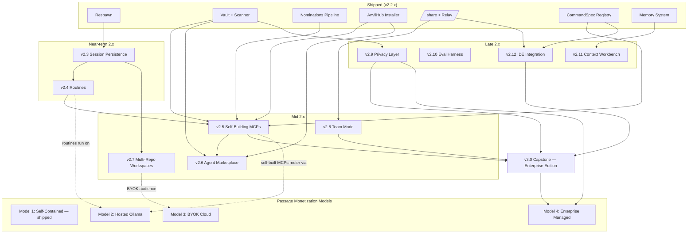

# Anvil — Unified Roadmap & Ecosystem Plan

**Approved:** 2026-04-20
**Arc:** v2.3 → v3.0 (eleven releases)
**Versioning note:** labels are **sequencing**, not schedule. Solo-founder pace + day job means each minor release is a multi-month effort. The roadmap is deliberately long so downstream dependencies are visible; it is not a commitment to ship at any particular rate.

---

## Revised roadmap (single ordered list)

| Order | Feature | Core value | Reuses |
|-------|---------|------------|--------|
| v2.3 | Session Persistence & Reconnect | Durability prerequisite | v2.2.6 respawn |
| v2.4 | Anvil Routines | Proactive agents; runtime for the pattern analyzer | new |
| v2.5 | **Self-Building MCP Servers** (new insertion) | Anvil improves its own tooling over time | v2.2.5 nominations, v2.2.5 vault scanner, v2.2.6 AnvilHub installer, v2.2.6 CommandSpec registry |
| v2.6 | Agent Marketplace & Composition | Human extensibility | v2.2.6 AnvilHub + vault gate |
| v2.7 | Multi-Repo Workspaces | Matches real engineering | breaks single-repo assumptions in session layer |
| v2.8 | Team Mode | Collaboration | v2.2.6 /share |
| v2.9 | Local Model Privacy Layer | Enterprise trust | v2.2.5 vault scanner |
| v2.10 | Evaluation Harness | Differentiator | 5-provider foundation |
| v2.11 | Context Engineering Workbench | UX polish | v2.2.5 memory system |
| v2.12 | Native IDE Integration | Distribution | v2.2.6 relay protocol + autocomplete registry |
| **v3.0** | **Capstone — Self-Hosted Enterprise Edition** | Arc-ending release; Passage Model 4 goes live | all of the above |

**Lean fallback ordering if priorities slip:** v2.3 → v2.4 → v2.5 → v2.12 → v2.6. Durability, proactive agents, self-improvement, distribution, then marketplace monetization. v3.0 still anchors the end.

---

## Dependency and flow diagram

---

## v2.5 — Self-Building MCP Servers (detailed spec)

This is the new entry and deserves the most space because it hasn't been specced yet. Everything else in the roadmap is already outlined in the source docs.

**What it is:** Anvil watches its own tool usage, detects repeated multi-step flows (Bash → HTTP → SSH → file ops), nominates a purpose-built MCP server that collapses the flow into one call, generates it, tests it, sandboxes it, registers it, and uses it going forward. User can publish successful ones to AnvilHub.

### Pipeline

1. **Pattern detection.** Session journal from v2.3 carries every tool invocation + args + timing + result. Background analyzer (runs as a Routine from v2.4) identifies repeated n-gram sequences of tool calls. Threshold-based: e.g., same 5-step flow 8 times in a month triggers a nomination. Heuristics first; optional small local Ollama model for fuzzier matching in a later 2.5.x point release.
2. **Nomination.** New category `mcp_opportunity` in the v2.2.5 nominations pipeline. User sees proposed tool list and approves scope.
3. **Generation.** Builder writes the MCP from templates. **Node templates for v2.5 (lower barrier), Rust templates added in v2.6.** Templates include: stdio transport scaffold, input validation helpers, vault integration, dry-run default, a test suite. All output must comply with the 6 rules in `feedback-mcp-hardening-principles.md` (honesty contract, input validation, no global replaces, no shell sed, dry-run default, no auto-generated notes).
4. **Validation.** Builder runs the generated test suite and refuses to register if tests fail. First real use is a shadow-run against the original detected pattern; output must match before promotion. Post-registration periodic health checks auto-disable any MCP whose failure rate exceeds N%.
5. **Sandboxing.** Each generated MCP gets its own vault scope (only credentials the user grants), a tool allowlist (no arbitrary bash / ssh / network without approval), and a resource budget (timeout, memory cap, max concurrent calls).
6. **Lifecycle.** `/mcp self list`, `/mcp self pause|disable|delete`, `/mcp self diff <id>`. Opt-in publish path pushes successful self-built MCPs to AnvilHub review queue.

### Open design choices (with defaults)

| Choice | Default for v2.5 | Revisit |
|--------|------------------|---------|
| Auto-build vs review-first on nomination | Review-first | Opt-in auto-build config flag can ship in v2.5.x |
| Scope granularity | Per-topic (`anvil-jira`, `anvil-k8s`, `anvil-aws`) | Maps cleanly to existing vault scopes |
| Pattern detection | Heuristics (n-gram + arg similarity) | LLM-assisted in later 2.5.x point release |
| Template language | Node | Rust templates added in v2.6 |

### Why this slot

- Needs v2.3's durable journal to detect patterns
- Needs v2.4 as the runtime for the analyzer
- Is itself a form of extensibility — pairs naturally with Agent Marketplace (v2.6) immediately after

### Strategic value

Most features make Anvil better at task X. This one makes Anvil better at *becoming* better at tasks. One-line pitch — *"the AI assistant that writes its own tools"* — is defensible and not currently claimed by any competitor.

---

## Mapping features to monetization models

The four Passage monetization models and the feature roadmap are not independent tracks. They interact:

### Model 1 — Self-Contained (shipped)

Blocker is distribution, not code. v2.3 and v2.4 still land under Model 1 and strengthen the free tier. README rewrite + HN launch + targeted subreddits are the near-term go-to-market actions, independent of roadmap work.

### Model 2 — Hosted Ollama (next revenue milestone)

Depends on v2.4 (Routines) because cloud-executed Routines are the first thing users will pay compute for.

- Build infrastructure cost-tracking as a **separate service** feeding raw cost data into Passage — do not bloat Passage itself
- Pick one hosting provider (Linode / OVH / Phoenix NAP), run a single pilot instance, prove the metering loop end to end before adding a second

### Model 3 — BYOK Cloud

Unlocks once Model 2 ops are stable. Passage gains logic to charge the orchestration fee per tab while attributing inference cost to the user's own provider keys. Pairs well with v2.7 (Multi-Repo) because consultants juggling client credentials are the natural BYOK audience.

### Model 4 — Enterprise Managed

Lands with the v3.0 capstone. Requires v2.9 (Privacy Layer) and v2.8 (Team Mode) as prerequisites — enterprises will not sign without privacy guarantees and team controls.

### Not on the roadmap, by design

**FIPS / federal track.** Documented as intent in the MVP doc. Keep algorithm choices FIPS-friendly opportunistically (don't introduce non-FIPS crypto), but no dedicated work until traction and funding exist. Revisit after Models 2 and 3 are generating revenue.

---

## Cross-cutting principles

- **Per-tab isolation stays the unit of billing and policy.** Every new feature must preserve it. Routines, self-built MCPs, Team Mode users, and workspaces all bill per-tab.
- **Nominations is the delivery vehicle for all "Anvil suggests X" UX.** New categories (`mcp_opportunity`, future ones) extend the existing system rather than growing parallel UIs.
- **AnvilHub is the distribution surface for all shareable artifacts.** Agents, skills, plugins, themes, self-built MCPs — one marketplace, not five.
- **Passage stays focused on routing + metering + billing.** Infrastructure cost accounting, lifecycle management, and provider licensing are separate services feeding Passage. Resist monolith drift.

---

## Critical files / surfaces likely touched

| Release | Surfaces |
|---------|----------|
| v2.3 | `anvil/session.rs` — session journal becomes durable |
| v2.5 | `anvil/nominations/` — new `mcp_opportunity` category; `anvil/vault/` — per-MCP scope grants |
| v2.5 | `anvilhub/` — self-built-MCP publish flow |
| v2.6 | `anvilhub/` — agent publish flow; vault — per-agent scope grants |
| v2.7 | `anvil/session.rs` — relax single-repo assumptions |
| v2.8 | `anvil/vault/` — per-user access grants |
| Model 2 | `passage/` — metering hooks for hosted Ollama |
| Model 3 | `passage/` — BYOK platform-fee logic |
| v3.0 / Model 4 | `passage/` — managed-pool billing |
| v2.5 forever | `feedback-mcp-hardening-principles.md` — template generator must enforce all six rules |

Exact paths depend on current Anvil tree; implementer should confirm before editing.

---

## Known risks (preserved from MVP doc)

1. **Distribution is the #1 risk.** Product is real; market awareness isn't. Phase 2 cannot succeed without fixing Model 1 distribution first.
2. **Infrastructure cost accounting is non-trivial.** Needs to be built right before Model 2 launches; wrong cost math eats margin.
3. **Complexity creep.** Four billing models, multi-provider orchestration, cloud lifecycle management — keep Passage focused, resist feature sprawl.
4. **Solo founder bandwidth.** Currently employed full-time elsewhere. Realistic pace matters more than ambitious roadmap.

---

## Near-term non-code actions (from MVP doc)

These are distribution / positioning work that must happen alongside v2.3 and v2.4, not after:

1. Rewrite Anvil GitHub README and culpur.net/anvil product page with freedom-first positioning
2. Draft a Hacker News launch post for Model 1 (rebrand the story, don't re-launch the code)
3. Scope Model 2: infrastructure cost tracking service, Ollama hosting plan, per-user metering exposure
4. Pick one provider (Linode / OVH / Phoenix NAP) and price out a hosted-Ollama pilot instance
5. Don't think about FIPS for at least another quarter
