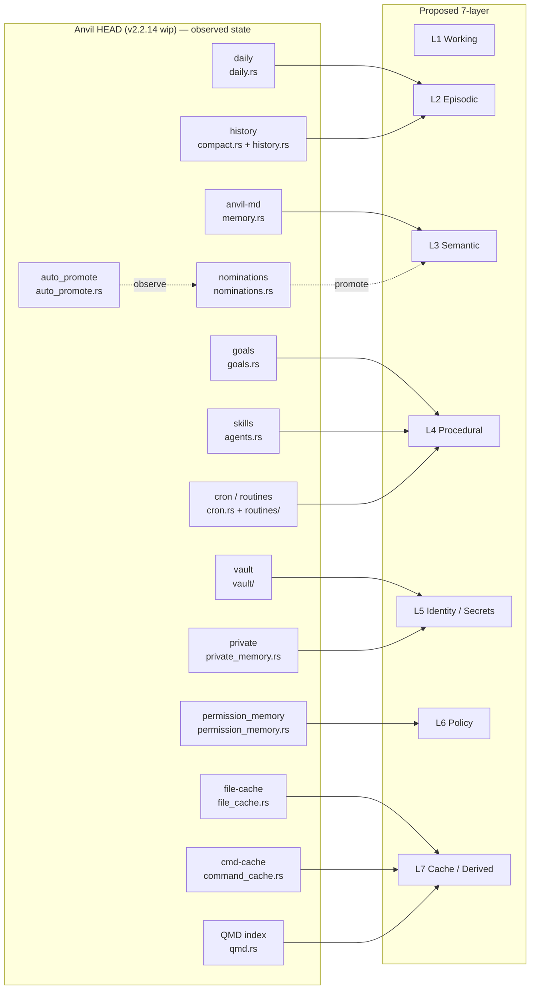

# Anvil — Seven-Layer Memory Redesign

**Date:** 2026-05-12
**Audience:** Anvil maintainers planning the v2.2.15+ memory work; future sessions picking up the redesign; reviewers of the migration buckets.
**Anvil version under audit:** HEAD of `/home/user/repo` — Cargo `workspace.package.version = "2.2.13"` (`Cargo.toml:6`) with v2.2.14 work-in-progress on `main` (recent commits prefixed `v2.2.14 ...`).
**Methodology:** Seven parallel agents read seven slices of the current memory surface and wrote per-layer audits at `docs/research/MEMORY-LAYER-{1..7}-*.md`. This doc is the synthesis — it does not re-prove claims; it points at the detail docs and reconciles them.

---

## How to read this doc

Three layers exist:

1. **This file (`SEVEN-LAYER-MEMORY.md`)** — the cross-layer synthesis. Top-level model, reconciled migration sequence, defects surfaced, what to skip.
2. **`MEMORY-LAYER-N-<name>.md` (1..7)** — per-layer audits. Each has the same 7-section schema (definition, current state, gaps, inspector surface, migration, risks, cross-layer). Every code claim cites `file.rs:LINE`.
3. **The code itself** — verify any claim with `grep` or `sed -n '<line>p'` at the cited location. Where this synthesis disagrees with the spec docstring in `crates/commands/src/specs.rs:241-285`, the *code* (handler behavior) is the source of truth and the spec docstring is the bug.

If you only have 10 minutes: read **The proposed 7-layer model** and **Discovered defects**. If you have 30 minutes: also read **Reconciled migration sequence**.

---

## The proposed 7-layer model

The cleavage is cognitive-lifecycle-based: each layer answers a distinct "what is this memory *for*?" question. Anvil's current 8 tiers (`/memory show <tab>` enumerates `anvil-md, vault, private, nominations, daily, file-cache, cmd-cache, goals`) grew organically — some, like `nominations`, are pipelines treated as peers; others, like `file-cache` and `cmd-cache`, are siblings that should be sub-tiers of one cache layer; and significant runtime memory state (`history`, `permission_memory`, QMD index) is invisible to `/memory` entirely. The 7-layer model re-cuts along function.

| # | Layer | Function (one line) | Current home(s) |
|---|---|---|---|
| **L1** | **Working** | The system-prompt blocks + recent-message buffer assembled for *this* turn. Transient. | `SystemPromptBuilder` (`prompt.rs:101-273`) + `CompactionConfig` (`compact.rs:10-22`). No `/memory` exposure today; `/memory why` (`handlers.rs:899-914`) prints hardcoded text. |
| **L2** | **Episodic** | Per-session events: what happened, what was decided, what was deferred. Replayable. | `daily` (`daily.rs`) + `~/.anvil/history/` archive (`compact.rs:31-54`, `history.rs:33-82`) + per-workspace `.anvil/sessions/*.json`. Only `daily` is currently in `/memory`. |
| **L3** | **Semantic** | Durable plaintext knowledge about *this project*. Hand-curated, AI-suggested via nominations, indexed by QMD. | `anvil-md` tier (`memory.rs`) + `nominations` (`nominations.rs`) **as a pipeline feeding L3, not a peer tier** + project-root `ANVIL.md` files (`prompt.rs:335-356`). |
| **L4** | **Procedural** | How-to memory: programs that **act**, not facts that describe. | `goals` (`goals.rs`) + 10 bundled skills (`agents.rs:724-766`) + on-disk skills (`agents.rs:178-253`) + cron/routines (`cron.rs`, `routines/`). Of these, only `goals` is in `/memory` today. |
| **L5** | **Identity / Secrets** | Encrypted, gated-by-vault-unlock state: credentials + sensitive infra facts. **Never auto-injected.** | `vault` (`vault/mod.rs`) + `private` (`private_memory.rs`). Share the same KEK (`private_memory.rs:9-11`). |
| **L6** | **Policy** | Persistent *decisions* about what the agent is allowed to do. | `permission_memory.rs` (today **dead code**, see Discovered defects #9) + auto-mode hard-deny (`auto_mode.rs`) + reviewer/egress/content-filter configs. Invisible to `/memory`. |
| **L7** | **Cache (derived)** | Recomputable performance state. Safe to nuke. | `file-cache` (`file_cache.rs`) + `cmd-cache` (`command_cache.rs`) + QMD index (`qmd.rs`). |

### Current → proposed mapping



Three category errors the redesign fixes:

1. **`nominations` is a peer tier in `/memory`** (`specs.rs:266`) but its module docstring (`nominations.rs:1-9`) explicitly describes it as a *pipeline staging area for L3*. Recast as `L3 --pending`.
2. **`file-cache` and `cmd-cache` are peer tiers** with `anvil-md`/`daily`/etc. They are *derived*; the peers are *durable*. Recast as `L7.file` and `L7.cmd`.
3. **`history`, `permission_memory`, and the QMD index are invisible to `/memory`** despite being real, sized, runtime-owned memory state. Promote them to L2/L6/L7 sub-views respectively.

---

## Per-layer one-page summary

Each row points to a detail doc that contains full sections 1–7 (definition, state, gaps, inspector surface, migration, risks, cross-layer).

### L1 — Working

- **What it owns:** the `system_prompt: Vec<String>` + message buffer that ride in every `ApiRequest` (`turn_executor.rs:55-58`). Two budgets: `MAX_TOTAL_INSTRUCTION_CHARS = 12_000` (`prompt.rs:52`) and `CompactionConfig` defaults `preserve_recent_messages: 6`, `max_estimated_tokens: 10_000` (`compact.rs:11, 18-19`).
- **Top gap:** `/memory why` (`handlers.rs:899-914`) is hand-written static text, not live introspection. Four `insert(0, …)` sites (`anvil-cli/src/main.rs:5466, 5672, 5790, 6754`, `utils.rs:1474-1475`) stomp each other and contradict the documented order. The `SYSTEM_PROMPT_DYNAMIC_BOUNDARY` marker (`prompt.rs:43, 251`) has no consumer.
- **Top migration move:** introduce `WorkingMemorySnapshot` + replace `Vec<String>` with `Vec<PromptSection { kind, body }>` so every section is named and `/memory why` becomes real introspection.
- **Detail:** `docs/research/MEMORY-LAYER-1-working.md`

### L2 — Episodic

- **What it owns:** three independently-designed stores — `~/.anvil/daily/YYYY-MM-DD.json` (per-day rollup, `daily.rs:18-51`); `~/.anvil/history/<session>-<ts>.md` (full conversation archive, `history.rs:33-82`); `<cwd>/.anvil/sessions/<id>.json` (live transcript). They don't know about each other.
- **Top gap:** `~/.anvil/history/` is invisible to `/memory` entirely (`handlers.rs:685-714, 716-776, 916-952`, `954-966` all skip `home.join("history")`). It is typically the largest disk consumer of any memory directory and has **no retention policy at all** — files accumulate forever.
- **Top migration move:** expose `episodic` as a unified L2 tier in `/memory show|budget|prune` that composes daily + history + workspace-sessions, and add a 90-day history retention (`ANVIL_HISTORY_RETENTION_DAYS` env override) with a trash-bin + dry-run for safety.
- **Detail:** `docs/research/MEMORY-LAYER-2-episodic.md`

### L3 — Semantic

- **What it owns:** project-root `ANVIL.md` files (loaded via `discover_instruction_files` at `prompt.rs:335-356`) plus per-project markdown at `~/.anvil/projects/<sha>/memory/*.md` (`memory.rs:64-72`). Nominations (`nominations.rs`) are the *pipeline* feeding L3, not a peer.
- **Top gap:** `/memory promote <id>` (`handlers.rs:833-845`) **does not actually promote** — it only flips the nomination's `status` field. `MemoryManager::save` is never called from production code (`memory.rs:131-150` has zero non-test callers). Accepted nominations never reach ANVIL.md.
- **Top migration move:** make `/memory promote` chain `NominationStore::get → MemoryManager::save / append-to-ANVIL.md → NominationStore::accept`, and add `nominated_from` frontmatter for provenance.
- **Detail:** `docs/research/MEMORY-LAYER-3-semantic.md`

### L4 — Procedural

- **What it owns:** the most fragmented layer in Anvil today. `goals` (in `/memory`), 10 bundled skills via `include_str!` (`agents.rs:724-766`, invisible to `/memory`), on-disk skills under `.codex/skills` / `.anvil/skills` (also invisible), and the cron/routines precursor (`cron.rs`, `routines/`) for which no slash command yet exists.
- **Top gap:** skill bodies inject into the system prompt (per `handlers.rs:906`) but `/memory` reports zero of them. `/memory budget` does not measure procedural-layer bytes at all. Cron `~/.anvil/cron.json` is reachable from runtime but has no user-facing surface.
- **Top migration move:** introduce a `procedural` tier in `/memory show` that composes `GoalManager::list()`, `load_skills_from_roots(discover_skill_roots(cwd))`, `BUNDLED_SKILL_BODIES`, and `CronManager::global().entries()`. Stub the `routines` sub-view as "Tier 2 in ROADMAP" until the TOML loader lands.
- **Detail:** `docs/research/MEMORY-LAYER-4-procedural.md`

### L5 — Identity / Secrets

- **What it owns:** vault (`vault/mod.rs`: AES-256-GCM with random per-credential DEK, KEK derived via Argon2id with `Params::new(65536, 3, 4, Some(32))` per `vault/mod.rs:257`) and private project memory (`private_memory.rs`: AES-256-GCM keyed by the *same* KEK). Vault and private are de facto one layer.
- **Top gap:** `vault::scan::classify_learning` (`vault/scan.rs:343-356`) is the documented auto-promote bridge into L5, but it has **zero production callers**. Today an LLM-suggested learning like `bastion=10.0.70.80` becomes a plaintext `nominations/*.json` file rather than a `private/<hash>.enc` blob — an **L3 plaintext leak of infra facts**. Separately: `handlers.rs:696` checks `vault.bin` (wrong path) for vault-init detection.
- **Top migration move:** wire `classify_learning` into the nomination-emit path, gated behind `ANVIL_L5_AUTOROUTE=1` for the first release; add a unified `identity` tier showing labels/keys (never values); add a `crates/runtime/tests/` integration test asserting no L5 value reaches any rendered prompt byte.
- **Detail:** `docs/research/MEMORY-LAYER-5-identity.md`

### L6 — Policy

- **What it owns:** `PermissionMemory` (`permission_memory.rs:1-191`) — `PermissionScope { Session, Project, Global }` and `PermissionMemoryEntry { tool_name, input_pattern, scope, granted_at }`. On disk at `~/.anvil/projects/<hash>/permissions.json` (project) and `~/.anvil/permissions.json` (global). Plus policy-adjacent state in `auto_mode.rs`, `permissions/reviewer.rs`, `egress.rs`, `content_filter.rs`.
- **Top gap:** the persistent L6 store is **dead code**. `grep "PermissionMemory" crates/ --include="*.rs" | grep -v 'permission_memory.rs\|lib.rs'` returns zero hits. The runtime gate at `conversation/permission_gate.rs:25-154` uses session-only `PermissionPromptDecision::AllowAlways` (`permissions/mod.rs:42`) and never consults the disk store. Wiring is exported from `lib.rs:122` but never constructed.
- **Top migration move:** load `PermissionMemory` on session start, query `is_allowed` before invoking the prompter, and call `grant + save` on `AllowAlways`. Then add a `policy` tier handler in `/memory show` mirroring the `anvil-md`/`daily` branches. Gate behind `permissions.use_permission_memory` (default off for upgrades, on for new installs) for one minor version.
- **Detail:** `docs/research/MEMORY-LAYER-6-policy.md`

### L7 — Cache (derived)

- **What it owns:** file-cache (`file_cache.rs:121`, sha-prefix-sharded at `~/.anvil/projects/<hash>/file-cache/<prefix>/<sha>.json`), cmd-cache (`command_cache.rs:562`, at `~/.anvil/projects/<hash>/cmd-cache/<cmd-hash>.json` with per-class TTL 60–1800s), and the QMD on-disk index (`qmd.rs:212-238`, owned by the external `qmd` CLI). All three are derivable from L1–L6 + filesystem.
- **Top gap:** `/file-cache` slash command is a **stub** (`handlers.rs:556-559`) that never instantiates `FileCacheManager`. `memory_summary`/`memory_budget` count wrong paths (`~/.anvil/file-cache/` vs the real `~/.anvil/projects/<hash>/file-cache/`), so cache counts in `/memory` are **always zero** in normal operation. `/memory prune` ignores L7 entirely. No size cap / LRU on either cache. **No enforcement** of the L5 invariant (cache MUST NOT contain decrypted vault content).
- **Top migration move:** fix the `/file-cache` stub by mirroring `/cmd-cache`'s handler; fix the path-mismatch bug; introduce a unified `cache` tier with `cache file|cmd|qmd` sub-views; add `/memory prune cache` chaining `FileCacheManager::prune` → `CommandCacheManager::prune_stale` → `qmd update`; encode the L5 invariant via `runtime::cache::is_l5_path` gating store/lookup.
- **Detail:** `docs/research/MEMORY-LAYER-7-cache.md`

---

## Discovered defects

The audits surfaced eleven concrete bugs in the *current* code, independent of the redesign. Most are exposed by the act of trying to describe each layer cleanly. They should be fixed regardless of whether the 7-layer reorganization ships.

| # | Layer | Defect | File:line | Severity |
|---|---|---|---|---|
| 1 | L1 | `/memory why` is hand-written static text, not live introspection. Claims 6 items but the live builder produces 7–13. | `handlers.rs:899-914` vs `prompt.rs:242-273` | Medium (misleads users) |
| 2 | L1/L2 | Daily-reconciliation injection promised by `/memory why` line 6 is **never wired**. No `DailyStore::today()` or `reconcile()` call exists in the prompt-build path. | `handlers.rs:908` vs `prompt.rs:253-262` (no caller) | High (silent contract break) |
| 3 | L1 | `SYSTEM_PROMPT_DYNAMIC_BOUNDARY` marker is inserted but never consumed (intended as a cache-stable / dynamic split for prompt caching). | `prompt.rs:43, 251` | Low (dead marker) |
| 4 | L2 | `~/.anvil/history/` is invisible to `/memory` (summary, show, budget, prune all skip it). Has **no retention** — files accumulate forever. | `handlers.rs:685-714, 716-776, 916-952, 954-966` | High (disk leak) |
| 5 | L3 | `/memory promote <id>` only flips `status`; **never appends to ANVIL.md or writes via `MemoryManager`**. `MemoryManager::save` has no production callers. | `handlers.rs:833-845` | **Critical** (accepted nominations are silently dropped) |
| 6 | L3 | `memory_summary` reads `~/.anvil/memory/`; `MemoryManager` writes to `~/.anvil/projects/<hash>/memory/`. The summary counts a directory the writer never populates. | `handlers.rs:688-689` vs `memory.rs:64-72` | High (cosmetic but consistently wrong) |
| 7 | L5 | `vault.bin` init-marker check is wrong path; real marker is `~/.anvil/vault/vault.meta`. `/memory` summary's vault row is always "not initialized." | `handlers.rs:696` vs `vault/storage.rs:50` | Medium (cosmetic) |
| 8 | L5 | `vault::scan::classify_learning` (the auto-promote bridge into L5) has zero production callers. Infra strings leak as plaintext nominations. | `vault/scan.rs:343-356` (no caller) | **Critical** (plaintext leak of sensitive facts) |
| 9 | L6 | `PermissionMemory` struct and disk store are dead code. Exported, tested, but no production caller; runtime gate uses session-only `AllowAlways` instead. | `permission_memory.rs:1-191` vs `permission_gate.rs:25-154` | High (documented feature is non-functional) |
| 10 | L7 | `/file-cache` slash command is a stub that prints usage and never instantiates `FileCacheManager`. `/cmd-cache` works correctly. | `handlers.rs:556-559` vs `handlers.rs:560-617` | High (asymmetric coverage) |
| 11 | L7 | `memory_summary` and `memory_budget` count `~/.anvil/{file,cmd}-cache/` but the real layout is `~/.anvil/projects/<hash>/{file,cmd}-cache/`. Cache counts are always zero. | `handlers.rs:707-710, 920-927` vs `file_cache.rs:131-145`, `command_cache.rs:578-582` | High (cosmetic but consistently wrong) |

Defects #5, #8, #9 are dead-code bugs (the feature is declared, exported, and tested in isolation, but no production caller wires it up). #2, #4, #6, #11 are quiet drift between docstring promises and handler behavior. None require a redesign to fix; all are landed cheaply in the bug-fix bucket below.

---

## Reconciled migration sequence

Combining each layer's section 5 with the discovered-defects table, the migration is ordered into four release buckets. Total scope: roughly **12–16 engineer-days** spread across four patch releases.

```mermaid
flowchart TD
  subgraph B1["Bucket 1 (v2.2.15) — Bug-fix"]
    b1a[L1 §1-3 label sections + drop insert(0,…)]
    b1b[L3 §3 storage-path mismatch]
    b1c[L5 §5 vault.bin path fix]
    b1d[L6 §1 wire PermissionMemory into gate]
    b1e[L7 §1-2 /file-cache stub + path bugs]
  end

  subgraph B2["Bucket 2 (v2.2.16) — Inspector unification"]
    b2a[L1 §4-5 /memory why + /memory budget introspection]
    b2b[L2 §1 expose history tier]
    b2c[L3 §1 nominations as pending sub-view]
    b2d[L4 §1-5 procedural tier]
    b2e[L5 §1-4 identity tier]
    b2f[L6 §2-5 policy tier]
    b2g[L7 §3-5 unified cache tier]
  end

  subgraph B3["Bucket 3 (v2.2.17) — Safety + semantics"]
    b3a[L3 §2 promote actually writes]
    b3b[L3 §5-7 QMD-index L3 corpus + provenance]
    b3c[L5 §6 classify_learning routing — flagged]
    b3d[L6 §7 PermissionEffect enum]
    b3e[L7 §8 L5 invariant enforcement]
    b3f[L5 §9 zero-injection integration test]
  end

  subgraph B4["Bucket 4 (v2.2.18) — Polish"]
    b4a[L2 §4 history retention 90d + trash-bin]
    b4b[L7 §9 LRU + size caps]
    b4c[L4 §11 /goal web_available audit]
    b4d[Deprecate aliases /file-cache /cmd-cache /history-archive /memory show nominations]
    b4e[L1 §9 SYSTEM_PROMPT_DYNAMIC_BOUNDARY consumer + prompt caching]
  end

  B1 --> B2
  B2 --> B3
  B3 --> B4

  b1e -. unblocks .-> b2g
  b1d -. unblocks .-> b2f
  b1a -. unblocks .-> b2a
  b2c -. precedes .-> b3a
  b3a -. precedes .-> b3c
  b3c -. requires .-> b3f
  b2g -. precedes .-> b3e
```

### Bucket 1 — v2.2.15 — Bug-fix (~3 days)

Independent of the redesign; ship as a fast-follow. Fixes defects #1, #6, #7, #9, #10, #11.

1. **L1 §1-3** — introduce `WorkingMemorySnapshot` + replace `Vec<String>` with `Vec<PromptSection>`; replace the four `insert(0, …)` sites with builder methods. (~1.5 days)
2. **L3 §3** — fix `memory_summary` to read `MemoryManager::memory_dir()` instead of `home.join("memory")`; fix `/memory why` text to name the real path. (~1 hour)
3. **L5 §5** — replace `home.join("vault.bin")` check with `runtime::vault_is_initialized()`. (~15 min)
4. **L6 §1** — load `PermissionMemory` on session start, consult `is_allowed` before prompting, call `grant + save` on `AllowAlways`. Gate behind `permissions.use_permission_memory` (default off for one cycle). (~1 day)
5. **L7 §1** — replace `/file-cache` stub with a real handler mirroring `/cmd-cache`'s dispatch. (~2–3 hours)
6. **L7 §2** — fix `memory_summary` and `memory_budget` to use `FileCacheManager::stats()` / `CommandCacheManager::stats()` rather than reading non-existent paths. (~1 hour)

### Bucket 2 — v2.2.16 — Inspector unification (~5 days)

Land the user-facing 7-layer model. All inspector additions; no schema or data migrations.

1. **L1 §4-5** — wire `/memory why` and `/memory show working` to introspect a live `WorkingMemorySnapshot` instead of printing static text; add a `working` row to `/memory budget`. (~6 hours)
2. **L2 §1** — add `episodic` tier in `memory_summary`, `memory_show`, `memory_budget`; alias `daily` as a sub-view. (~4 hours)
3. **L3 §1** — recast `nominations` as `semantic --pending`; keep `nominations` as a documented alias for one cycle. (~4 hours)
4. **L4 §1-5** — `procedural` tier composing goals + skills + cron entries + routines-output archive. Stub the `routines` sub-view with a ROADMAP pointer. (~12 hours)
5. **L5 §1-4** — `identity` tier showing labels/keys (when unlocked) and counts only (when locked). (~9 hours)
6. **L6 §2-5** — `policy` tier showing permission grants, auto-mode hard-deny, reviewer extras, egress allowlist. (~6 hours)
7. **L7 §3-5** — unified `cache` tier with `cache file|cmd|qmd` sub-views; `/memory inspect` walks L7. (~10 hours)
8. Spec + subcommand updates across `specs.rs:241-285` and `subcommands.rs:1490-1499`. (~2 hours)

### Bucket 3 — v2.2.17 — Safety + semantics (~4 days)

The hard bits: change *write* behavior, not just inspector-side reads. Fixes defects #5 and #8.

1. **L3 §2** — `/memory promote` actually writes to ANVIL.md / `MemoryManager`. Atomic-write via `.tmp + rename`; `--dry-run` flag. (~1 day)
2. **L3 §5-7** — register `anvil-semantic` QMD collection; add `nominated_from` frontmatter; rename auto-generated `MEMORY.md` → `_index.md` to disambiguate. (~6 hours)
3. **L5 §6** — wire `vault::scan::classify_learning` into the nomination-emit path; route `Credential` → reject, `Infrastructure` → `PrivateProjectMemory::upsert` (vault-unlocked) or banner (locked), `Knowledge` → existing nomination. Gate behind `ANVIL_L5_AUTOROUTE=1` for first release. (~6 hours)
4. **L6 §7** — add `PermissionEffect { Allow, Deny, Prompt }` to `PermissionMemoryEntry` with `#[serde(default)]` for forward compat. (~2 hours)
5. **L7 §8** — `runtime::cache::is_l5_path` sentinel gating `FileCacheManager`/`CommandCacheManager` store/lookup; debug-assert no vault-derived `touched_files`. (~1 day)
6. **L5 §9** — `crates/runtime/tests/` integration test: assemble a full system prompt with vault unlocked + populated private memory, assert no L5 label/key/value appears anywhere in the rendered bytes; extend with a cache-scan assertion for the L7 invariant. (~2 hours)
7. **L2 §2** — fix the `/memory why` daily-reconciliation lie: either wire `DailyStore::today()` into prompt build (gated, capped) or amend the help text. (~3 hours)

### Bucket 4 — v2.2.18 — Polish (~2.5 days)

Retention, caps, alias deprecations, documentation. Lowest urgency; absorbed into normal release flow.

1. **L2 §4** — add 90-day history retention (`ANVIL_HISTORY_RETENTION_DAYS`); pruner moves files to `~/.anvil/.trash/` before delete; `--dry-run` flag. (~3 hours)
2. **L7 §9** — `ANVIL_FILE_CACHE_MAX_MB` and `ANVIL_CMD_CACHE_MAX_MB` env vars (default 50 MB each); LRU eviction by `last_seen` / `captured_at`. (~1 day)
3. **L4 §11** — audit `/goal` for TUI-only writes; flip `web_available: true` for read paths if safe. (~2–8 hours)
4. Deprecate aliases: `/file-cache` and `/cmd-cache` redirect to `/memory show cache file|cmd`; `/history-archive` redirects to `/memory show episodic`; `/memory show nominations` redirects to `/memory show semantic --pending`. Keep aliases for one cycle, then hard-error. (~3 hours total)
5. **L1 §9** — consume `SYSTEM_PROMPT_DYNAMIC_BOUNDARY` in the provider layer for prompt-cache hits (split into cache-stable head + dynamic tail). (~1 day)

---

## Cross-layer dependency notes

Surfaced by reading all seven section-7s together. These are constraints the implementer must respect during the buckets above.

- **L1 ↔ L7.** The `<known-files>` block in the system prompt is L7-derived text injected into L1. After Bucket 4 §5 (dynamic-boundary consumer), this becomes the cache-stable head — order matters: dynamic-boundary lands *after* L7 is correctly counted (Bucket 1 §6) but *before* prompt-cache rollout.
- **L1 ↔ L4.** `insert(0, …)` sites for goal fragment, skill body, and "fast" prefix all stomp index 0. Bucket 1 §1 reorganizes this; Bucket 2 §4 (L4 procedural tier) depends on it because the procedural inspector lists *which* skill is loaded — that requires builder methods, not `insert`-stomp.
- **L2 → L3 via nominations.** Daily summaries can feed nominations (auto_promote `AccessKind::FactStated`, `auto_promote.rs:181-195`). Bucket 3 §1 (real promote) changes the terminal state of this pipeline.
- **L3 ↔ L7.** QMD indexes L3 corpus (Bucket 3 §2 registers `anvil-semantic`). The L7 cache invariant (Bucket 3 §5) explicitly excludes L5; it does *not* exclude L3 — that's correct because L3 is plaintext-safe.
- **L5 ↔ L3.** The `User` and `Feedback` `MemoryType` variants (`memory.rs:10-16`) are user-scoped, not project-semantic — arguably L5 not L3. L3 §6 proposes moving them, but the migration sequence defers this: depends on L5 design landing first.
- **L5 ↔ L7.** The hardest invariant: no L7 byte may contain unencrypted L5 content. Bucket 3 §5 (sentinel) enforces; Bucket 3 §6 (zero-injection test) verifies.
- **L6 ↔ L7.** Cache hits should respect *current* permission scope, not the scope at write time. Today's lookup (`command_cache.rs:593-620`) doesn't consult permissions. Bucket 3 §4 (PermissionEffect enum) is the prerequisite; cache-scope coupling itself is out of scope for this redesign — flag for follow-up.
- **L6 ↔ L5.** Vault *unlock state* is L5 (knowledge gating). Per-secret access *grants* are L6 (which tools may dereference vault keys). Don't merge them.

---

## Strict SKIP list

Things this redesign explicitly does **not** change:

| Item | Why skip |
|---|---|
| Vault on-disk format, KEK derivation, Argon2id params | Working as designed; security-critical surface; no audit finding suggests change. |
| QMD CLI surface (the external binary) | Anvil consumes QMD as a black box; reshaping it is out of scope. |
| Daily session-summary JSON schema | Stable on-disk format; downstream parsers (gsd, exports) may rely on it. |
| Permission scope variants (`Session/Project/Global`) | Three is right; no audit recommends adding a fourth. |
| Per-credential DEK + envelope encryption | Working as designed (`vault/mod.rs:9-11`). |
| Skill registration / discovery roots | Procedural-tier exposure does not touch how skills are *found*, only how they're *reported* in `/memory`. |
| The `nominations` JSON sidecar format | After Bucket 3 §1 it becomes audit metadata; format unchanged. |
| `/vault` slash command and its subcommands | Independent surface; L5 inspector additions are read-only views. |
| Cron expression format (5-field cron in v2.2.13) | Schedule grammar expansion (ROADMAP Tier 2 item 2) is its own work; L4 audit only stubs the routines sub-view. |
| Permission gate evaluation order | After Bucket 1 §4, `PermissionMemory::is_allowed` slots between reviewer and prompter; the (1) auto-mode hard-deny → (2) hook → (3) reviewer → (4) memory → (5) policy/prompter order is preserved. |

---

## Reconciliation with ROADMAP + ROUTINES-ADOPTION-NOTES

The redesign touches three live planning documents.

**`ROADMAP.md`:**

- Tier 2 items 1–4 (`[SILENT]`, schedule grammar, output archive, packet schema) are L4 Procedural work and land *outside* this redesign. Bucket 2 §4 (procedural tier) stubs the routines sub-view so it has a place to populate when those land.
- Tier 2 item 5 (TOML loader) → unblocks the L4 routines sub-view (Bucket 2 §4 stub becomes real).
- Tier 2 item 12 (pre-agent script + wake gate) → lands inside L4; no L7-cache interaction.
- Tier 2 item 13 (vault-ref resolution `vault:<label>`) → L5/L4 boundary. The L5 audit's safety invariant (resolve at *render time*, never at *memorise time*) must be honored when this lands.
- Tier 2 item 15 (pre-dispatch reconciliation) → L4 procedural concern; out of scope here.
- A **new Tier 2 item to add**: `permissions.use_permission_memory` default flip (was off in Bucket 1, flipped on after one cycle).

**`docs/ROUTINES-ADOPTION-NOTES.md`:**

- §7.5 (token-budgeted injection) → L1 working-memory budget (Bucket 1 §1 lays the groundwork).
- §10.5 (pre-dispatch state reconciliation) → L4 procedural concern, but the *episodic* drift reports it would produce should land in L2 (Bucket 2 §2 history retention).
- §11 (vault-ref) → same L5 safety constraint as above.
- §12.5 (skill discipline, red_flags frontmatter) → L4 procedural metadata; Bucket 2 §4 inspector should surface `red_flags` if present.

**README §4 (`/memory`):**

- The 8-tier enumeration at lines 124–125 ("`/memory show <Tab>` enumerates the 8 valid tier names") becomes the 7-tier model after Bucket 2 ships. Update the README in the same release that lands Bucket 2.
- The release-notes 6-tier claim at `README.md:337, 385` ("v2.2.5: Intelligent memory system — 6-tier architecture") is historical and stays.

---

## Verification

The synthesis is correct only if its claims resolve in the current tree. To spot-check:

```bash
# Verify the dead-code claims (defects #8, #9):
grep -rn "classify_learning" crates/ --include='*.rs' | grep -v 'scan.rs'
# Expect: no production hits (only tests/docs)

grep -rn "PermissionMemory" crates/ --include='*.rs' \
  | grep -v 'permission_memory.rs\|lib.rs'
# Expect: no production hits

# Verify the stub claim (defect #10):
sed -n '556,559p' crates/commands/src/handlers.rs

# Verify the wrong-path claim (defect #11):
sed -n '707,710p' crates/commands/src/handlers.rs
sed -n '131,145p' crates/runtime/src/file_cache.rs

# Verify the never-promotes claim (defect #5):
sed -n '833,845p' crates/commands/src/handlers.rs
grep -rn "MemoryManager::save\|memory_manager.save\|MemoryManager\s*{[^}]*}\.save" \
  crates/ --include='*.rs' | grep -v test
# Expect: no production hits
```

If any of these returns hits where this synthesis claims none, the audit is wrong and the defect listing in this doc should be revised before the implementer reads it.

---

## What this research did NOT do

Honesty about scope:

- **No external comparison.** This audit is internal-only — Anvil's current state vs a proposed redesign. No comparison to Letta, mem0, Zep, Cognee, etc. If a future cycle wants external grounding, run a separate `COMPARE-vs-*-MEMORY.md` pass.
- **No code changes.** Every line in the synthesis is a recommendation. The seven detail docs each end with a numbered migration list; implementation lands per the bucket sequence above in subsequent sessions.
- **No benchmarks.** No timing comparison of "with cache" vs "without cache," no measurement of how much the prompt-budget cap actually bites in real sessions.
- **No user-research.** The 7-layer cleavage is defensible on a cognitive-function basis; whether actual Anvil users will find `/memory show procedural` more discoverable than `/memory show goals` + `/memory show skills` is untested.
- **No web-session audit.** Several handlers gate on `tui_available` / `web_available`. Only L4 §11 flags the asymmetry. A separate web-session audit could confirm every new tier has a sensible web behavior.
- **No migration of existing on-disk data.** The buckets above are pure code changes; no `~/.anvil/` layout changes ship in any bucket except L7 (and L7's "fix" is just *reading* the correct path that already exists, not *moving* data).
- **No external-process audit.** QMD is treated as a black box. The L7 sub-tier `qmd-index` reports stats and triggers `qmd update`; it does not inspect or migrate the QMD index format.

---

## See also

- `docs/research/MEMORY-LAYER-1-working.md` — L1 Working detail
- `docs/research/MEMORY-LAYER-2-episodic.md` — L2 Episodic detail
- `docs/research/MEMORY-LAYER-3-semantic.md` — L3 Semantic detail
- `docs/research/MEMORY-LAYER-4-procedural.md` — L4 Procedural detail
- `docs/research/MEMORY-LAYER-5-identity.md` — L5 Identity / Secrets detail
- `docs/research/MEMORY-LAYER-6-policy.md` — L6 Policy detail
- `docs/research/MEMORY-LAYER-7-cache.md` — L7 Cache (derived) detail
- `docs/research/RESEARCH-SUMMARY.md` — previous cross-project research synthesis (six external projects)
- `ROADMAP.md` — Tier 2 routines backlog (touches L4 and L7)
- `docs/ROUTINES-ADOPTION-NOTES.md` — active design document for L4 routines work
- `crates/commands/src/specs.rs:241-285` — current `/memory` spec
- `crates/commands/src/handlers.rs:680-966` — current `/memory` handler family